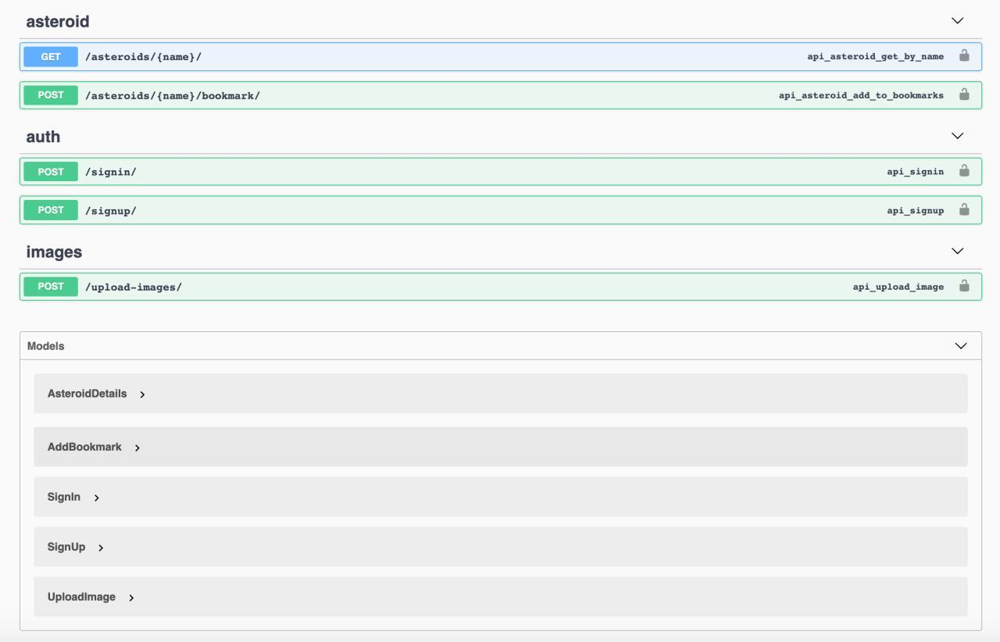

# Сервис для работы с каталогом астероидов

# Содержание

- [Тестовое задание](#Тестовое-задание)
- [Установка зависимостей](#Установка-зависимостей)
- [Инициализация проекта](#Инициализация-проекта)
- [Тестирование API ( Swagger)](#Тестирование-api)

<a name='Тестовое-задание'></a>
###Тестовое задание
Реализовать сервис (API) для работы с каталогом астероидов
1) Пользователи могут загружать фотографии астероидов
Для каждой фотографии пользователи указывают:
    - дату и время, когда сделана фотография
    - название одного или нескольких астероидов, которые попали на фотографию
Сервис должен валидировать названия астероидов (по каталогу NASA)
2) Сервис должен отдавать информацию об астероиде по его имени. 
В информации об астероиде должны присутствовать список URL фотографий, если они были загружены для этого астероида. 
Информацию об астероидах можно взять из API  https://api.nasa.gov/ Asteroids - NeoWs
3) Реализовать возможность регистрации в сервисе (получение токена)
4) Реализовать возможность добавления астероидов в закладки
При реализации используйте любой Python  фреймворк на ваш выбор. 
Важно обратить внимание на читаемость кода, покрытие тестами и легкость развёртывания.

<a name='Установка-зависимостей'></a>
###Установка зависимостей
1. Предполагается, что poetry уже установлен. В консоли необходимо выполнить команду:
    ```
    poetry install
    ```
    Виртуальное окружение создается автоматически, а все указанные зависимости подтянуты.  

2. В файле `.env.example` представлены все настройки, необходимые для инициализации докера, 
    а также логины, пароли, используемые в интеграции.
    ```
    cp ./.env.example ./.env.ddd
    ```
    В файле не указан NASA_API_KEY=1, для запроса необходимо подставить своё значение. 
    
<a name='Инициализация-проекта'></a>
###Инициализация проекта
Чтобы запустить проект необходимо предпринять следующие шаги:
1. Открыть терминал
2. Выполнить запуск проекта
    ```
    docker-compose -f docker-compose.yaml up --build -d
    ```
    В YAML файле,  помимо разворачивания проекта, выполняется так же:
    - Сбор статики;
    - Миграции БД;
    - Команда loadnasa загружает данные с сервера NASA с объектами - астероидами; 

3. Для просмотра данных в админке необходимо создать пользователя:
    ```
    python manage.py createsuperuser
    ```

Теперь вам оставется только запустить тесты, для того, 
чтобы удостовериться в корректности всех выполненных ранее действий.

<a name='Тестирование-api'></a>
###Тестирование API
Для удобства тестирования в проект добавлен swagger, где можно найти информацию об эндпоинтах, 
сериализаторах данных.

